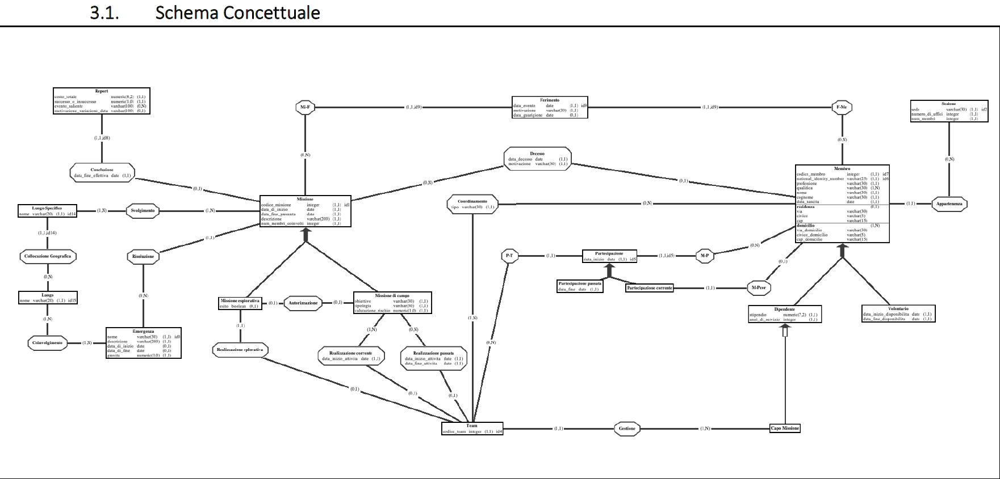
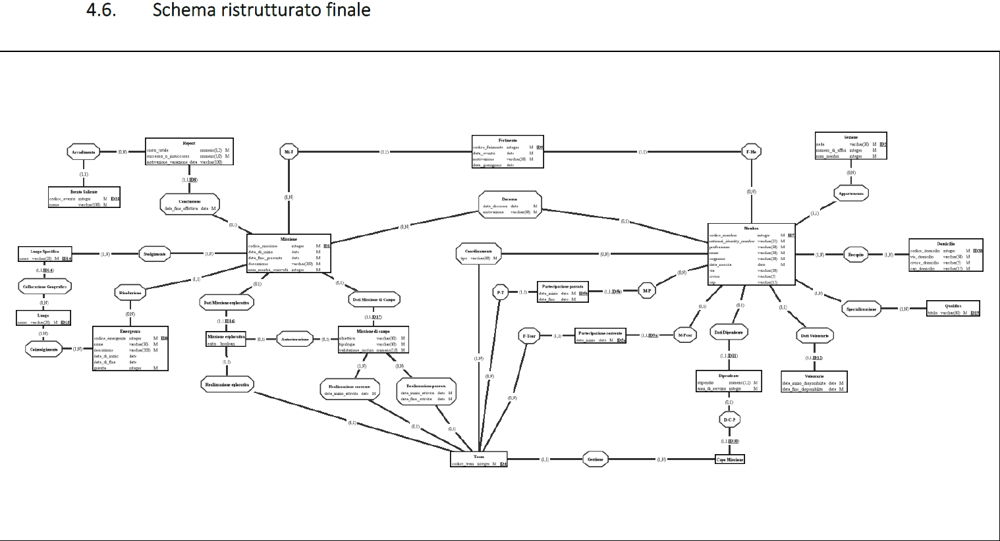
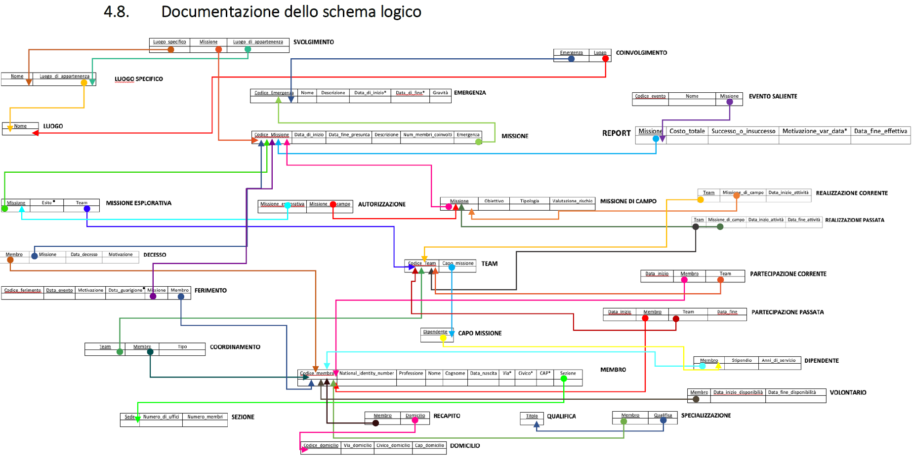

# Medici Senza Frontiere Database Project (PostgreSQL)

   

## Overview
This project involves the design and implementation of a database system for managing the missions of "Medici Senza Frontiere" (MSF), an organization that provides medical assistance in emergencies around the world. The system will handle information about the organization's structure, personnel, volunteers, and missions.

## Project Scope
The implemented database aims to store information concerning:
- **Organizational Structure**:
   - The organization is divided into sections or national offices, each located in a specific country.
   - Personnel includes doctors, nurses, medical professionals, logisticians, engineers, and administrators. Employee details include personal information, address, profession, and qualifications. Mission history for each employee is also of interest.
   - Volunteers have similar data recorded, with an additional focus on their availability periods.
- **Emergency Operations**: MSF operates in emergency situations, organizing field missions. Emergencies are characterized by a name, description, start date (if available), and the locations involved (e.g., countries or regions like Kenya, Mediterranean Sea, etc.).
- **Field Missions**:
   - Each field mission has a start date, expected end date, actual end date, mission objective, type, risk assessment, and a description.
   - Missions are carried out by one or more teams, consisting of both employees and volunteers. Each team has a mission leader (always an employee) and several coordinators.
   - Missions take place in specific locations (cities or regions) within the emergency territories.
   - After a mission, a report is stored, detailing the success or partial success/failure, including information on total cost, personnel involved, significant events, and any deviation from the planned timeline with reasons.
- **Exploratory Missions**: Before a field mission, a small team may conduct an exploratory mission to evaluate its feasibility. The outcome of this assessment needs to be recorded.
- **Mission Incidents**: During missions, some members may be injured or deceased. This information should be documented within the mission context, along with relevant details.
- **Database Schema**: The database will be designed to accommodate the above specifications, ensuring efficient data storage, retrieval, and management.

## Design and Implementation Steps
- **Descrizione della realtà di interesse**: An in-depth description of the real-world context and requirements for the MSF database system.
- **Analisi delle specifiche**
- **Progettazione Concettuale**:
   - Schema Concettuale
   

      
   

   - Design Pattern
   - Dizionario dei Dati
   - Regole Aziendali
- **Progettazione Logica**:
   - Ristrutturazione Schema Concettuale
   - Analisi delle ridondanze
   - Eliminazione delle generalizzazioni
   - Partizionamento/Accorpamento Entità e Associazioni
   - Scelta degli identificatori principali
   - Schema ristrutturato finale
   

      
   

   - Schema logico
   - Documentazione dello schema logico
   

      
   

- **Normalizzazione**
- **Script Creazione e Popolamento Database**
- **Query SQL**
- **Viste**
- **Triggers**

## More Information

For more detailed information, please refer to the [final project relation document](https://github.com/MattiaMarseglia/Volunteer-Mission-Management-System/blob/main/Relazione%20Basi%20di%20Dati%20I-Z%20Gruppo%2012.pdf).

Feel free to reach out for any clarifications or suggestions. Thank you for your contribution to the "Medici Senza Frontiere" Database Project!
